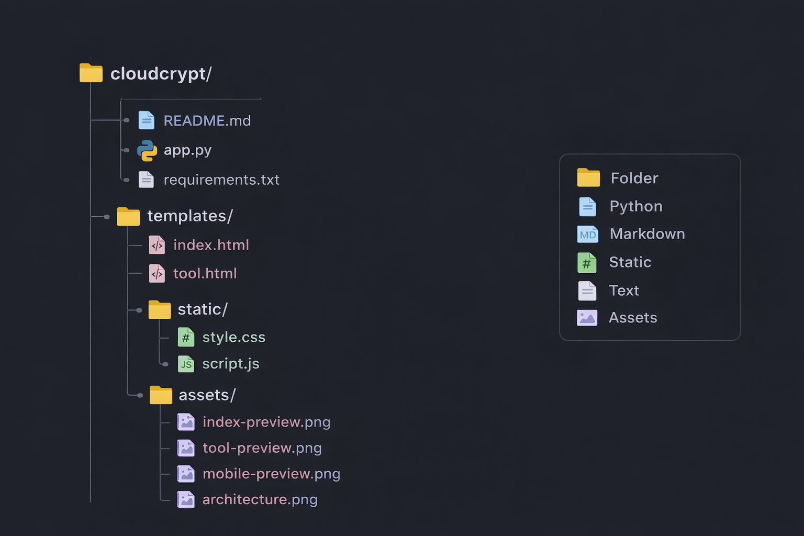

# 🔐 CloudCrypt  
### Encryption & Decryption Web Platform

CloudCrypt is a modern **web-based cryptographic application** designed to demonstrate both **classical and modern encryption algorithms** through a clean, premium user interface.  
The project focuses on learning **cryptography concepts**, **client–server architecture**, and **UI/UX best practices**.

---

## 📌 Project Overview

CloudCrypt allows users to:

- 🔒 Encrypt and decrypt text using multiple algorithms  
- 🧠 Learn how encryption techniques work  
- 🌐 Interact with a secure Python backend  
- 🎨 Use a modern interface with dark & light themes  

The application is divided into:
- 🏠 **Homepage** – Project introduction and overview  
- 🛠 **Tool Page** – Actual encryption & decryption operations  

This structure improves usability and gives the project a **professional, product-like feel**.

---

## 🧰 Technology Stack

### 🎨 Frontend
- **HTML5** – Structure & layout  
- **CSS3** – Glassmorphism UI, gradients, themes  
- **JavaScript (Vanilla)** – User interaction & API calls  

### ⚙️ Backend
- **Python**  
- **Flask** – Lightweight web framework  

### 🔐 Cryptography
- **AES (Advanced Encryption Standard)**  
- **Caesar Cipher**  
- **Base64 Encoding / Decoding**  

---

## ✨ Features

### 🔐 Cryptographic Features
- Caesar Cipher Encryption & Decryption  
- Base64 Encode & Decode  
- AES Encrypt & Decrypt  

### 🎨 UI / UX Features
- Premium glassmorphism design ✨  
- Gradient background with depth-of-field effect 🌈  
- Dark 🌙 / Light ☀️ theme toggle  
- Password strength meter 🔑  
- Algorithm description panel 📘  
- Copy-to-clipboard output 📋  
- Back navigation button 🔙  

---

## 📱 Mobile Optimization

CloudCrypt is fully **mobile-responsive** and optimized for smaller screens using modern CSS techniques.

### Mobile Features:
- 📐 Responsive layout using CSS media queries
- 📱 Automatic stacking of panels on mobile devices
- 👆 Touch-friendly buttons and input fields
- 🔠 Improved text readability on small screens
- 🚫 No horizontal scrolling on mobile browsers

The user interface dynamically adapts to different screen sizes, ensuring a smooth experience on both **desktop and mobile devices**.

---

## 🔄 Application Workflow

1. 🏠 User opens the **Homepage**  
2. 📖 Reads about CloudCrypt  
3. ➡️ Navigates to the **Tool Page**  
4. ✍️ Enters text and key (if required)  
5. 🔘 Selects encryption/decryption algorithm  
6. 🌐 Frontend sends request to Flask backend  
7. ⚙️ Backend processes encryption/decryption  
8. 📤 Result is displayed on the UI  

---

## 📁 Project Structure



---

## 🔢 Algorithms Implemented

### 🟦 Caesar Cipher
A classical substitution cipher that shifts characters by a fixed number.  
Used mainly for **educational purposes**.

### 🟨 Base64 Encoding
An encoding technique used for safe data representation.  
(Not true encryption, but useful for data transmission.)

### 🟩 AES (Advanced Encryption Standard)
A modern **symmetric encryption algorithm** where the same key is used for encryption and decryption.  
Widely used in real-world security systems.

---

## ▶️ How to Run the Project

### 1️⃣ Install dependencies
```bash
pip install -r requirements.txt

python app.py


